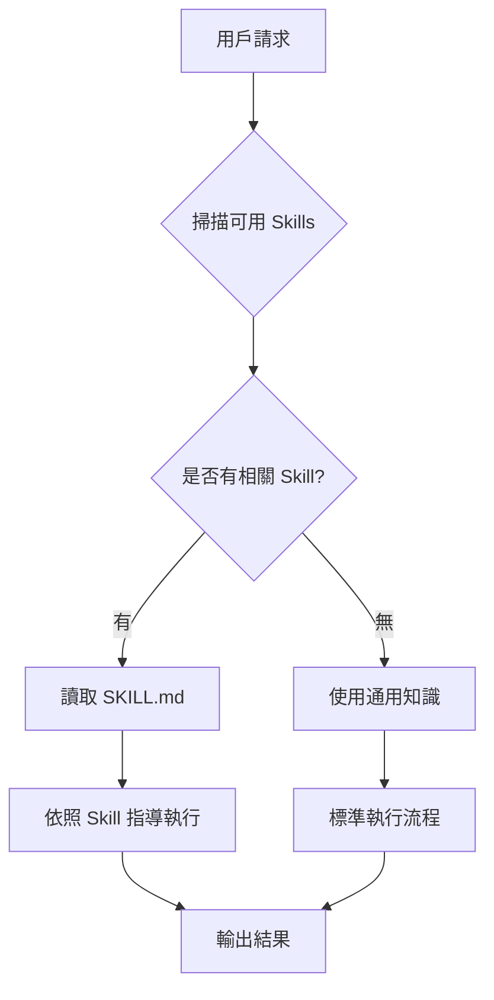

# 🤖 AI Agent 與 Skill 完整教學
> Claude 中的智能代理與技能系統：概念、架構、使用與設計

---

## 目錄

- [[#什麼是 AI Agent？]]
- [[#什麼是 Skill？]]
- [[#Instruction、Skill、Agent 三者關係]]
- [[#Agent 與 Skill 在 Claude 中的角色]]
- [[#系統架構概覽]]
- [[#Skill 的運作機制]]
- [[#如何使用 Skill]]
- [[#如何設計 Skill]]
- [[#SKILL.md 結構詳解]]
- [[#進階設計技巧]]
- [[#常見問題與最佳實踐]]
- [[#實戰範例]]

---

## 什麼是 AI Agent？

### 核心定義

**AI Agent（智能代理）** 是一種能夠**自主感知環境、做出決策並執行行動**以達成目標的 AI 系統。它不只是「回答問題」，而是可以：

- 🔍 主動搜尋資訊
- 🛠️ 呼叫工具與 API
- 📁 操作檔案與系統
- 🔄 根據結果調整策略
- 🔗 串接多個步驟完成複雜任務

### Agent vs. 一般 LLM 的差異

| 特性    | 一般 LLM | AI Agent |
| ----- | ------ | -------- |
| 互動模式  | 單輪問答   | 多步驟自主執行  |
| 工具使用  | 無      | 可呼叫外部工具  |
| 記憶能力  | 單次對話   | 可跨步驟保存狀態 |
| 任務複雜度 | 單一任務   | 複合任務拆解   |
| 主動性   | 被動回應   | 主動規劃與執行  |

### Agent 的思考循環

```
感知 (Perceive)
    ↓
規劃 (Plan)
    ↓
執行 (Act)
    ↓
觀察 (Observe)
    ↓
[重複直到目標達成]
```

---

## 什麼是 Skill？

### 核心定義

**Skill（技能）** 是一組**預先定義的知識、流程與工具的集合**，告訴 Claude 在特定情境下應該「怎麼做」。

簡單比喻：
> 如果 Claude 是一位顧問，**Skill** 就是他書架上的專業手冊——遇到特定問題時取出翻閱，依照手冊的最佳實踐來執行。

### Skill 的核心組成

```
Skill = 觸發條件 + 執行知識 + 資源工具
```

- **觸發條件**：什麼情況下應該使用這個 Skill？
- **執行知識**：如何高品質地完成這類任務？
- **資源工具**：需要哪些腳本、模板、參考文件？

### Skill 解決的問題

| 沒有 Skill        | 有 Skill      |
| --------------- | ------------ |
| Claude 從零思考每個任務 | 直接套用已驗證的最佳流程 |
| 輸出品質不穩定         | 輸出品質一致且可預期   |
| 容易遺漏複雜步驟        | 系統性完成所有必要步驟  |
| 難以客製化特定領域       | 可針對領域深度優化    |

---

## Instruction、Skill、Agent 三者關係

> 在進入「Agent 與 Skill 的角色」之前，必須先把更基礎的概念 — **Instruction（指令）** — 放回它應有的位置。
> 沒有 instruction 的概念，Skill 與 Agent 都是空的容器。

### 為什麼要把 Instruction 拉出來單獨講？

`Instruction` 是 LLM 的**最小語意單位**：一段告訴模型「該做什麼、以什麼角色、依何規範、產出何種格式」的輸入。
而 Skill 與 Agent 不是與 instruction 並列的另一種東西 — 它們是**對 instruction 的封裝與調度**：

```
Instruction（最小單位，給 LLM 的一段條件化輸入）
        ▲
        │ 預先封裝、給定觸發條件
        │
     Skill（一份可被觸發、含資源的 instruction 包）
        ▲
        │ 接收 query、判斷該用哪個 Skill、串接多步驟
        │
     Agent（會選用 Skill、調用工具、自我規劃的執行者）
```

換句話說：
- **Instruction** 是「一句精確的口令」
- **Skill** 是「一本寫得很完整、附範本與腳本的工作手冊」（其本質就是結構化的 instruction）
- **Agent** 是「會挑手冊、按手冊操作、必要時組合多本手冊的員工」

### 三者的對照表

| 維度    | Instruction  | Skill                       | Agent                 |
| ----- | ------------ | --------------------------- | --------------------- |
| 形式    | 單次自然語言輸入     | 資料夾（含 SKILL.md + 資源）        | 系統（模型 + 工具 + 記憶）      |
| 生命週期  | 一次對話內        | 跨對話、可版本控制                   | 跨會話運行                 |
| 作者    | 使用者當下撰寫      | 設計者預先撰寫                     | 平台提供（Claude / Cowork） |
| 觸發方式  | 直接送出         | 由 Agent 依 description 判斷而觸發 | 由使用者發起任務              |
| 改善槓桿  | 個人 prompt 技巧 | 流程封裝與資源管理                   | 模型能力 + 工具生態           |
| 失敗時表現 | 輸出模糊、跑偏      | 該觸發未觸發 / 觸發後執行偏差            | 任務未完成、卡在某步            |

### Skill 是「instruction 的封裝產品」

把 SKILL.md 拆開看，會發現它其實就是一份**寫得特別嚴謹的 instruction**：

| SKILL.md 的元素 | 對應到 instruction 設計的概念 |
| ------------- | --------------------- |
| `name`        | 識別符（給 Agent 內部索引）     |
| `description` | **觸發用的 meta-instruction**（決定 Agent 在何時讀它） |
| 「背景與目標」段     | Role + Why（為什麼要做、為誰做） |
| 「執行流程」段      | Task decomposition + Output format |
| 「重要注意事項」段   | Constraints / Bounded（不要做什麼） |
| 「常見錯誤與解決」段 | Error recovery instruction |
| `references/` | 按需載入的延伸 context       |
| `scripts/`    | 確定性步驟外包（避免讓 LLM 自由發揮） |

也就是說，**設計一個好 Skill = 設計一份好 instruction，再加上資源與觸發條件**。

### 常見 Instruction 設計原則如何映射到 Skill 設計

如果熟悉 instruction 設計的七大原則（Specific / Contextualized / Role-Defined / Iterative-Friendly / Bounded / Evaluable / Sourced，可參考 [[Instruction設計方法論_醫學影像AI研究者指南]]），對 Skill 設計可直接遷移：

| Instruction 原則     | 在 Skill 中的具體體現                                |
| ------------------ | --------------------------------------------- |
| Specific（具體）       | description 列出明確觸發詞、流程寫成有序步驟而非泛論              |
| Contextualized（脈絡） | SKILL.md 開頭交代背景、目標讀者、典型情境                     |
| Role-Defined（角色清晰） | 在流程中為 Claude 指派子角色（如「現在以資料審查員身份檢查輸出」）         |
| Iterative-Friendly | 預留「若用戶要求修改 X，請執行 Y」的修正路徑                      |
| Bounded（有邊界）       | description 與內容皆寫明「不適用於 …」「禁止 …」              |
| Evaluable（可評估）     | 內建自我檢查步驟（如「輸出後驗證所有引用是否真實存在」）                  |
| Sourced（可溯源）       | 透過 `references/` 與外部 MCP，把 RAG 概念落地到 Skill 內部 |

### Agent 是 Instruction / Skill 的調度層

Agent 的價值在於它**不需要使用者每次都把完整 instruction 寫滿**：
- 使用者只給一句相對自然的請求
- Agent 內部已掌握「哪些 Skill 可用、它們的 description 是什麼、需要哪些工具」
- Agent 自動把使用者的隱含意圖補成完整 instruction，並在必要時讀取對應 Skill

因此可以這樣理解：

```
使用者輸入 (簡短) ──► Agent 補完 ──► 內部 instruction (完整)
                                     │
                                     ├── 自帶系統 prompt（who / how）
                                     ├── 觸發的 Skill 內容（what / steps）
                                     └── 對話歷史 / 記憶（context）
```

> [!IMPORTANT]
> **核心啟示**：當你發現 Agent 表現不好時，問題幾乎不在「Agent 不夠聰明」，而在於：
> 1. 觸發的 **Skill description 不夠精準**（meta-instruction 失準），或
> 2. Skill 內部的 **執行 instruction 寫得模糊**（缺乏具體性、邊界、評估條件）。
>
> 修 Skill 之前，先回到 instruction 設計的七大原則重新檢視，往往就能找到根因。

---

## Agent 與 Skill 在 Claude 中的角色

### Claude 的 Agentic 能力框架

Claude 在 Anthropic 的產品中具備多層次的 Agent 能力：

```
┌─────────────────────────────────────────┐
│              Claude Agent               │
├─────────────────────────────────────────┤
│  Tools Layer（工具層）                   │
│  - Web Search    - File System          │
│  - Code Execution - Browser Control    │
│  - External APIs - MCP Servers         │
├─────────────────────────────────────────┤
│  Skills Layer（技能層）                  │
│  - 領域知識封裝                          │
│  - 最佳實踐指導                          │
│  - 流程模板                             │
├─────────────────────────────────────────┤
│  Memory Layer（記憶層）                  │
│  - 對話歷史                             │
│  - 用戶偏好記憶                          │
│  - 跨會話知識                           │
└─────────────────────────────────────────┘
```

### Skill 在系統中的位置

當 Claude 收到任務請求時，系統流程如下：



### Skills 的載入機制（Progressive Disclosure）

Skills 採用**漸進式載入**設計，避免佔用過多 Context：

```
層級 1：Metadata（永遠在 Context 中）
    name + description ≈ 100 字
    
層級 2：SKILL.md 主體（觸發時載入）
    完整指導內容 ＜ 500 行
    
層級 3：Bundled Resources（按需載入）
    腳本、參考文件、資產（無限制）
```

---

## 系統架構概覽

### Skill 資料夾結構

```
my-skill/
├── SKILL.md              ← 必要：主要指導文件
├── scripts/              ← 可執行腳本
│   ├── process.py
│   └── validate.sh
├── references/           ← 參考文件
│   ├── api-docs.md
│   └── best-practices.md
└── assets/               ← 資源檔案
    ├── template.docx
    └── logo.png
```

### SKILL.md 基本結構

```markdown
---
name: skill-identifier
description: 何時使用、做什麼、觸發情境
---

# Skill 標題

## 背景與目標
...

## 執行流程
...

## 注意事項
...
```

---

## Skill 的運作機制

### 1. 觸發機制

Claude 通過 `available_skills` 清單來決定是否使用某個 Skill：

- 系統將每個 Skill 的 `name` + `description` 提供給 Claude
- Claude **根據 description 判斷**是否需要使用該 Skill
- 符合條件時，Claude 讀取完整的 SKILL.md 內容

> [!IMPORTANT]
> **Description 是觸發的核心**！寫得好的 description 能確保 Claude 在正確時機使用 Skill。

### 2. 決策邏輯

Claude 在以下情況**更傾向觸發** Skill：
- 任務複雜、多步驟
- 需要特殊格式輸出（如 .docx、.pptx）
- 涉及特定領域的最佳實踐
- 用戶明確提到相關關鍵字

Claude 在以下情況**可能不觸發** Skill：
- 任務過於簡單（一步即可完成）
- 沒有明確的領域特徵
- 通用知識已足夠回答

### 3. 執行流程

```
[收到請求]
    ↓
[掃描 available_skills 的 metadata]
    ↓
[判斷相關 Skill]
    ↓
[呼叫 view 工具讀取 SKILL.md]
    ↓
[依照指導執行任務]
    ↓
[按需讀取 references/ 或執行 scripts/]
    ↓
[產出結果]
```

---

## 如何使用 Skill

### 使用者端（User-facing）

作為使用者，你**不需要**明確指定使用哪個 Skill，只需：

```
✅ 自然語言描述任務即可
"請幫我製作一份 Word 報告，包含封面和目錄"
→ Claude 自動觸發 docx Skill

"分析這個 PDF 的財務數據"
→ Claude 自動觸發 pdf-reading Skill

"建立一個 React 儀表板"
→ Claude 自動觸發 frontend-design Skill
```

### 明確觸發（可選）

你也可以明確指示：

```
"使用你的前端設計技能，製作一個..."
"按照最佳實踐，幫我創建一個 Excel 表格..."
```

### 查詢可用 Skills

可以詢問 Claude：
```
"你有哪些可用的技能？"
"你能幫我處理 PowerPoint 嗎？"
```

---

## 如何設計 Skill

### 設計流程總覽

```
1. 確定目標
    ↓
2. 訪談與研究
    ↓
3. 撰寫 SKILL.md
    ↓
4. 測試與評估
    ↓
5. 迭代優化
    ↓
6. 打包發布
```

### Step 1：確定目標

在撰寫 Skill 之前，先回答這幾個問題：

```
□ 這個 Skill 要讓 Claude 做什麼？
□ 什麼時候應該觸發？（用戶會說什麼？）
□ 期望的輸出格式是什麼？
□ 需要哪些工具或資源？
□ 成功的標準是什麼？
```

**範例分析：**
> **目標**：製作高品質的 Word 文件
> **觸發**：用戶要求 .docx、Word 報告、商業文件
> **輸出**：格式正確的 .docx 檔案
> **工具**：python-docx 套件
> **成功標準**：文件可正常開啟、格式符合商業標準

### Step 2：撰寫 Description（最關鍵！）

Description 決定觸發準確率，需要包含：

```markdown
description: |
  [核心功能描述] 何時使用（觸發情境列表）
  [輸出說明] 預期產生的結果
  [不觸發情況] 明確排除的場景（可選）
```

**❌ 弱 Description 範例：**
```
description: 建立文件
```

**✅ 強 Description 範例：**
```
description: |
  創建 Word 文件（.docx）。每當用戶提到：
  Word 文件、.docx、商業報告、備忘錄、信件、
  含有目錄/頁碼/標題格式的文件時使用。
  也適用於從其他格式轉換為 Word 文件。
  不適用於 PDF、試算表或純文字檔案。
```

**Description 撰寫技巧：**

| 技巧     | 說明          | 範例                        |
| ------ | ----------- | ------------------------- |
| 列出觸發詞  | 明確列出用戶可能說的詞 | "Word doc", ".docx", "報告" |
| 描述使用場景 | 說明在哪些情境下有用  | "格式化商業文件時"                |
| 排除干擾   | 說明不應觸發的情況   | "不適用於純文字回覆"               |
| 積極推銷   | 讓描述稍微「主動」一點 | "遇到任何文件相關請求都應使用"          |

### Step 3：撰寫 SKILL.md 主體

#### 結構模板

```markdown
---
name: my-skill
description: [詳細觸發說明]
---

# My Skill 名稱

## 背景
[為什麼需要這個 Skill？解決什麼問題？]

## 用戶提供的輸入
[描述 Claude 會收到什麼輸入]

## 執行流程

### 步驟 1：[準備階段]
[具體指導]

### 步驟 2：[核心執行]
[具體指導]

### 步驟 3：[輸出與驗證]
[具體指導]

## 重要注意事項
- [注意事項 1]
- [注意事項 2]

## 常見錯誤與解決方案
[已知問題的解決方法]
```

#### 好的 Skill 內容應該包含

```
✅ 明確的執行步驟（有序）
✅ 具體的程式碼範例或指令
✅ 錯誤處理指導
✅ 輸出格式規範
✅ 邊界條件說明
✅ 指向 references/ 文件的引用
```

### Step 4：管理資源文件

#### scripts/ 目錄
放置可執行的腳本，用於：
- 確定性的資料處理
- 重複性的操作
- 需要精確計算的任務

```python
# scripts/create_document.py
"""
用途：創建基礎 Word 文件結構
用法：python create_document.py --title "報告標題" --output report.docx
"""
from docx import Document
import argparse
...
```

#### references/ 目錄
放置參考文件，Claude 按需讀取：

```
references/
├── api-reference.md    ← API 文件
├── style-guide.md      ← 樣式指南  
└── examples.md         ← 範例集合
```

> [!TIP]
> 超過 300 行的 references 文件應加入**目錄（Table of Contents）**，幫助 Claude 快速定位相關內容。

#### assets/ 目錄
放置模板、圖片等靜態資源：

```
assets/
├── template.docx    ← Word 模板
├── logo.png         ← 品牌標誌
└── style.css        ← 樣式表
```

### Step 5：測試與迭代

#### 撰寫測試案例

```
測試案例設計原則：
□ 涵蓋典型使用情境
□ 包含邊界條件
□ 測試複雜多步驟任務
□ 驗證輸出格式正確性
```

**範例測試案例：**

```
測試 1：基本功能
輸入："幫我寫一份季度財務報告，包含封面、目錄和三個章節"
期望：輸出正確的 .docx 檔案，含封面、目錄和三個格式化章節

測試 2：邊界條件
輸入："把這個 CSV 數據轉成 Word 表格"
期望：正確讀取 CSV 並創建格式化的 Word 表格

測試 3：複雜格式
輸入："製作含有頁首頁尾、頁碼和公司標誌的商業備忘錄"
期望：所有格式元素都正確呈現
```

#### 評估標準

| 評估維度  | 問題                 |
| ----- | ------------------ |
| 觸發準確率 | Skill 在應該觸發時是否觸發了？ |
| 輸出品質  | 產出是否符合標準？          |
| 流程完整性 | 是否遺漏了重要步驟？         |
| 錯誤處理  | 遇到問題時是否適當處理？       |

---

## SKILL.md 結構詳解

### YAML Frontmatter

```yaml
---
name: skill-name          # 必要：唯一識別符，小寫連字號
description: |            # 必要：觸發說明（最重要的部分！）
  詳細的觸發條件...
  使用情境...
compatibility:            # 可選：依賴項
  tools:
    - bash
    - python
---
```

### 主體內容最佳實踐

#### ✅ DO：應該做的事

```markdown
# 使用清晰的標題層級
## 二級標題
### 三級標題

# 提供具體的命令和代碼
```bash
pip install python-docx --break-system-packages
python create_doc.py --output result.docx
```

# 列出具體步驟
1. 首先安裝依賴套件
2. 讀取輸入資料
3. 創建文件結構
4. 驗證輸出

# 說明何時讀取 references
詳細的 API 文件請參考 `references/api-docs.md`
```

#### ❌ DON'T：避免的事

```markdown
# 避免過於模糊的指示
做好這件事。（太模糊）

# 避免過長的 SKILL.md（超過 500 行）
# → 將詳細內容移到 references/ 目錄

# 避免重複 description 中已有的觸發說明
```

### 多領域 Skill 組織方式

當 Skill 支援多個子領域時：

```
cloud-deploy/
├── SKILL.md              ← 主文件：工作流程 + 選擇指南
└── references/
    ├── aws.md            ← AWS 特定指南
    ├── gcp.md            ← GCP 特定指南
    └── azure.md          ← Azure 特定指南
```

SKILL.md 中的選擇邏輯：
```markdown
## 平台選擇

根據用戶提到的雲端平台，讀取對應的參考文件：
- AWS / Amazon → 讀取 `references/aws.md`
- GCP / Google Cloud → 讀取 `references/gcp.md`  
- Azure / Microsoft → 讀取 `references/azure.md`
```

---

## 進階設計技巧

### 1. 讓 Description 更「主動」

描述應該稍微「推銷」自己，讓 Claude 傾向使用：

```
弱版：
"當用戶需要創建 Excel 時使用"

強版：
"當用戶提到試算表、Excel、.xlsx、數據表格、
財務報表或任何需要結構化數據輸出時，務必使用
此 Skill，即使用戶沒有明確要求 Excel 格式"
```

### 2. 避免觸發衝突

多個 Skill 可能競爭同一類型的任務，需要：

```markdown
# 在 description 中明確邊界
description: |
  用於創建 PowerPoint 簡報（.pptx）。
  [注意：純文字回覆或 Markdown 不需要此 Skill；
   如果用戶要求 PDF，使用 pdf Skill 而非此 Skill]
```

### 3. 指導 Claude 何時讀取資源

不要讓 Claude 猜測，明確指示：

```markdown
## 讀取指南

**立即讀取**（每次使用都需要）：
- `references/core-api.md`

**按需讀取**（根據具體需求）：
- 若涉及圖表 → `references/chart-guide.md`
- 若涉及公式 → `references/formula-reference.md`
- 若輸入是 CSV → `references/csv-handling.md`
```

### 4. 提供錯誤恢復策略

好的 Skill 應該包含常見錯誤的解決方案：

```markdown
## 常見問題排除

### 問題：套件安裝失敗
原因：可能是 Python 環境問題
解決：使用 `pip install --break-system-packages` 標誌

### 問題：輸出檔案無法開啟
原因：可能是編碼或版本問題
解決：確認使用 python-docx >= 0.8.11，並儲存為 .docx 格式

### 問題：圖片無法嵌入
原因：圖片路徑或格式不支援
解決：確保圖片為 PNG/JPEG，路徑使用絕對路徑
```

### 5. 輸出路徑規範

在 Skill 中統一輸出路徑：

```markdown
## 輸出規範

所有生成的檔案必須：
1. 先在 `/home/claude/` 工作目錄中創建
2. 完成後複製到 `/mnt/user-data/outputs/`
3. 使用 `present_files` 工具提供給用戶

範例：
```bash
cp result.docx /mnt/user-data/outputs/result.docx
```
```

---

## 常見問題與最佳實踐

### Q1：Skill 的長度限制是多少？

> SKILL.md 主體建議**不超過 500 行**。超過時，將詳細內容移到 `references/` 目錄，並在 SKILL.md 中提供清晰的指引說明何時讀取哪個文件。

### Q2：如何確保 Skill 被正確觸發？

> 關鍵在於 **description** 的品質。建議：
> 1. 列出用戶可能使用的關鍵詞
> 2. 描述具體的使用情境
> 3. 讓描述稍微主動/積極
> 4. 定期測試觸發準確率

### Q3：一個 Skill 可以依賴另一個 Skill 嗎？

> 不建議直接依賴，但可以在 SKILL.md 中提示 Claude 某些子任務可能需要參考其他技能。

### Q4：Skill 如何與 MCP 工具整合？

> 在 SKILL.md 中直接描述如何使用 MCP 工具：
> ```markdown
> ## 工具整合
> 使用 Google Drive MCP 工具讀取用戶的文件：
> 1. 呼叫 gdrive_search 搜尋相關文件
> 2. 使用 gdrive_fetch 獲取文件內容
> 3. 處理後儲存到輸出目錄
> ```

### Q5：如何測試 Skill 的效果？

> 建立一個測試集，每個測試案例包含：
> - **輸入**：用戶請求
> - **期望觸發**：是/否
> - **期望輸出**：格式和內容的具體要求
> - **評估標準**：如何判斷成功

---

## 實戰範例

### 範例 1：簡單的 Markdown 報告 Skill

```markdown
---
name: markdown-report
description: |
  創建結構化的 Markdown 報告和分析文件。
  當用戶要求報告、分析、技術文件或任何
  需要清晰結構化輸出的長文件時使用。
  輸出為 .md 格式，適合在 Obsidian 或其他
  Markdown 編輯器中查看。
---

# Markdown 報告 Skill

## 目標
創建結構清晰、格式規範的 Markdown 報告。

## 執行步驟

### 1. 分析需求
- 確認報告主題和範圍
- 識別目標讀者
- 確認所需章節

### 2. 建立結構
使用以下標準模板：
- 標題和日期
- 執行摘要
- 主要內容（按需求分章節）
- 結論與建議
- 附錄（若需要）

### 3. 填充內容
- 每個章節使用適當的標題層級（H2, H3）
- 重要資訊使用粗體或 callout 框
- 數據使用表格呈現
- 流程使用列表或 Mermaid 圖表

### 4. 輸出
儲存至 `/mnt/user-data/outputs/report.md`
並呼叫 `present_files` 提供下載。

## 格式規範
- 使用 Obsidian 相容的 Callout 語法
- Mermaid 圖表用於流程視覺化
- 內部連結使用 [[雙括號]] 語法
```

### 範例 2：數據處理 Skill

```markdown
---
name: data-analyzer
description: |
  分析 CSV/Excel 數據並生成視覺化報告。
  當用戶上傳數據文件（.csv, .xlsx, .json）
  並要求分析、圖表、統計摘要或洞察時使用。
  即使用戶只說「分析這個」或「告訴我這數據說了什麼」
  也應觸發此 Skill。
---

# 數據分析 Skill

## 執行流程

### 1. 讀取數據
```python
import pandas as pd
df = pd.read_csv('/mnt/user-data/uploads/data.csv')
print(df.head())
print(df.describe())
print(df.dtypes)
```

### 2. 基本統計分析
- 記錄數量和欄位
- 缺失值檢查
- 數值欄位統計（均值、中位數、標準差）
- 類別欄位分佈

### 3. 視覺化
使用 matplotlib 或 plotly 生成：
- 分佈圖（Histogram）
- 相關性熱圖
- 趨勢圖（如有時間序列）

### 4. 輸出報告
生成 Markdown 報告，包含：
- 數據概覽表格
- 關鍵發現（3-5 條）
- 圖表（嵌入 base64 或單獨檔案）
- 建議後續分析方向
```

---

## 總結

### AI Agent 與 Skill 的核心價值

```
Skill = 讓 Claude 從「通用智能」升級為「領域專家」
Agent = 讓 Claude 從「回答問題」升級為「自主完成任務」
```

### 設計好 Skill 的三個關鍵

```
1. Description 要精準→確保正確觸發
2. 流程要具體→減少模糊空間
3. 資源要組織好→按需取用，不佔資源
```

### 學習路徑建議

```
初學者：
    → 閱讀現有 Skill（/mnt/skills/public/）
    → 嘗試修改 description 並測試
    → 從簡單的單步驟 Skill 開始

進階者：
    → 設計多步驟、多資源的複雜 Skill
    → 建立測試集，量化評估效果
    → 使用 skill-creator Skill 協助優化

專家：
    → 設計 Skill 生態系（多個 Skill 協作）
    → 整合 MCP 工具和外部 API
    → 優化觸發準確率至 95%+
```

---

*文件最後更新：2026-04-27*  
*適用版本：Claude Sonnet 4.x 及以上*

---

**相關資源**
- [[Instruction設計方法論_醫學影像AI研究者指南]] — Instruction 的形式化定義、七大原則、RCTCOE 框架（Skill 設計的理論底層）
- [[新手教學 - 從零開始用 Agent 與 Skill]] — 入門級對應教學
- [[Skill 索引]] — 已收錄的 Skill 速查
- [[SKILL.md 模板]]
- [[MCP 工具整合指南]]
- [[Agent 設計模式]]
- [[Prompt Engineering 最佳實踐]]
